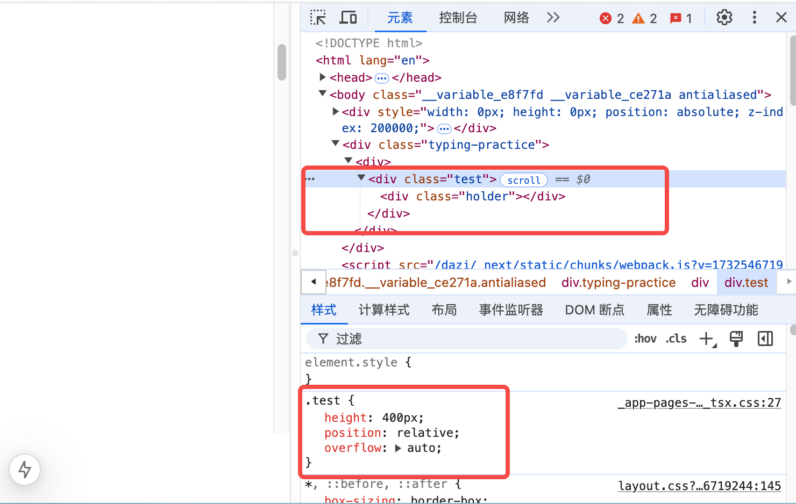
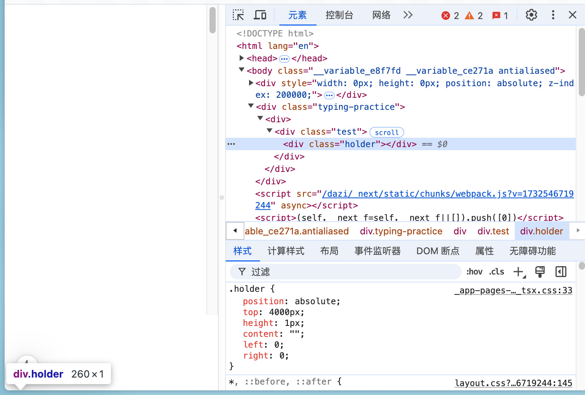
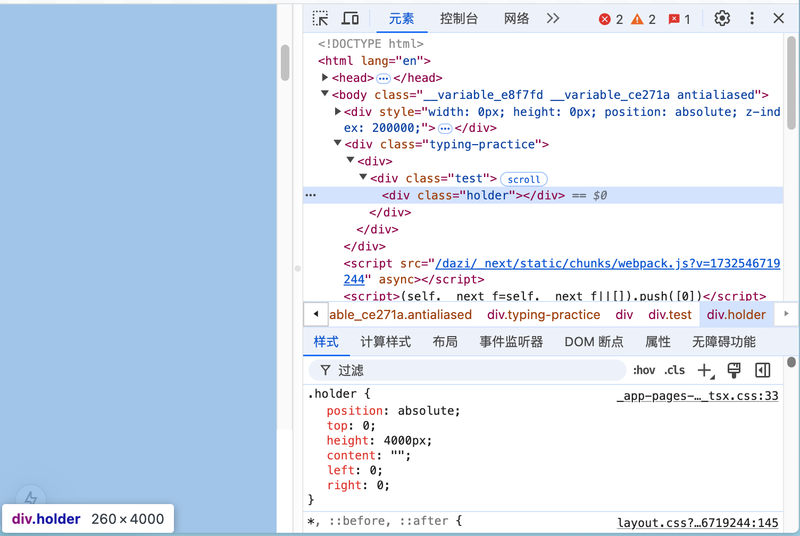
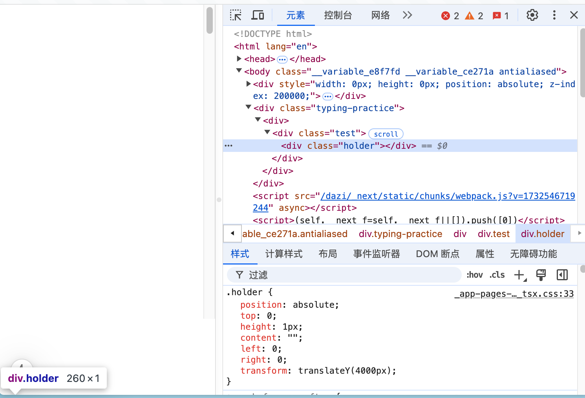

# 如何实现一个非固定高度的虚拟列表


1. 计算好每条数据的位置
1. 创建一个容器（滚动区域）
1. 获取容器的滚动高度
1. 初始化滚动列表
1. 动态化滚动列表

## 1. 计算好每条数据的位置

首先我们来模拟一些数据

```js
const data = Array.from(100000).fill(0).map((,index)=>({
  height: Math.random() * 500,
  text: "Item " + index,
  translateY: 0
}))
```

然后我们计算每条数据的位置

```js
for (let i = 1, I = data.length; i < I; i++) {
  data[i].translateY = data[i - 1].height + data[i - 1].translateY;
}
```

## 2. 创建一个容器（滚动区域）

目前了解有三种方法

1. position: absolute; top: 2000px;

   
   

2. position: absolute; height: 2000px;

   
   

3. position: absolute; transform: translateY(2000px);

   
   

我们使用 translateY 来创建一个滚动区域

在此之前我们需要先计算好可以滚动的列表高度

```js
const lastItem = data[data.length - 1];
const boxHeight = lastItem.height + lastItem.translateY;
```

然后来创建一个滚动区域

```jsx
<div
  style={{
    position: "relative",
    height: height + "px",
    transform: "translateY(0)",
    background: "rgba(0,0,0,0.1)",
    overflow: "auto",
  }}
>
  <div
    className="scroll-holder"
    style={{
      position: "absolute",
      transform: `translateY(${boxHeight}px)`,
    }}
  ></div>
</div>
```

## 3.初始化滚动列表

我们已经有一个可以滚动的区域了，那么接下来需要填充数据
我们可以根据当前容器的高度和之前计算好的偏移值来计算能够当前视口能够放下多少条数据

```js
function getCount() {
  let i = 0;
  let len = data.length;
  let count = 0;
  while (i < len && data[i].translateY < containerHeight) {
    ++i;
    ++count;
  }

  return count;
}
```

拿到当前能够放置的数量后，我们就可以初始化我们的渲染数据了

```js
const renderData = data.slice(0, getCount());
```

然后我们就可以渲染我们的列表了

```jsx
<div
  style={{
    position: "relative",
    height: height + "px",
    transform: "translateY(0)",
    background: "rgba(0,0,0,0.1)",
    overflow: "auto",
  }}
>
  <div
    className="scroll-holder"
    style={{
      position: "absolute",
      transform: `translateY(${boxHeight}px)`,
    }}
  ></div>
  {renderData.map((d) => {
    return (
      <div
        key={d.text}
        className="item"
        style={{
          height: `${d.height}px`,
          position: "absolute",
          transform: `translateY(${d.translateY}px)`,
        }}
      >
        {d.text}
      </div>
    );
  })}
</div>
```

## 4.动态化滚动列表

在初始化完成后，我们就得到了一个只有首屏的列表了，那么应该怎么让它在滚动的时候也能够有数据呢？

我们可以使用 onScroll 来监听滚动区域的变化，然后根据 scrollTop 来计算视口中第一个元素的下标，继而可以获取新的 count，也就能够获取当前区域所要渲染的数据了。

```js
const onScroll = (e) => {
  const top = e.target.scrollTop;
  const index = getIndex(top);
  const count = getCount(index);
  const renderData = data.slice(index, index + count);
};

function getIndex(top) {
  let i = 0;
  const len = data.length;
  while (i < len && data[i].translateY < top) i++;

  // 计算出来的i会大于滚动区域的顶部，即顶部会有一些空白，所以我们的索引后退一位
  return Math.max(0, i - 1);
}

function getCount(index = 0) {
  let i = index;
  let len = data.length;
  let count = 0;
  while (i < len && data[i].translateY < containerHeight) {
    ++i;
    ++count;
  }

  return count;
}
```

## 完结撒花


